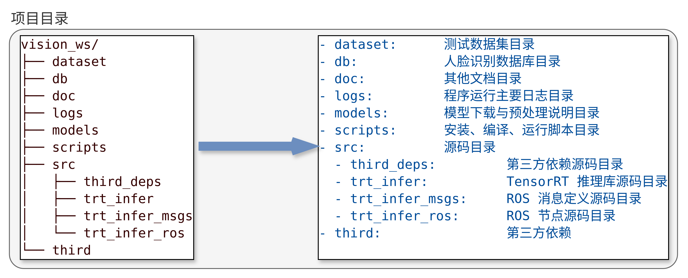
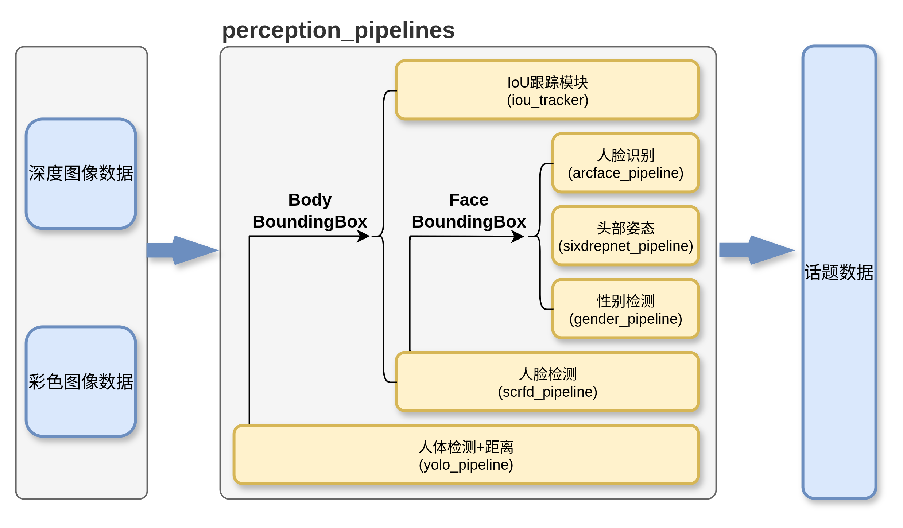

# 视觉项目开发

## Support platform

<table>
    <tr>
        <th>Platform</th><th>OS</th><th>CUDA/TensorRT</th><th>Support</th>
    </tr>
    <tr>
        <td rowspan="2">X86_64</td><td rowspan="2">Ubuntu 22.04 + ROS2 Humble</td><td>CUDA 13.3 + TensorRT 11.2.1</td><td>✅</td>
    </tr>
    <tr>
        <td>CUDA 12.8 + TensorRT 10.9.0</td><td>✅</td>
    </tr>
    <tr>
        <td>Jetson AGX Orin</td><td>Ubuntu 22.04 + ROS2 Humble</td><td>JetPack6.2</td><td>✅</td>
    </tr>
</table>

## 目录结构



## 视觉推理流程



## 依赖安装

```bash
./scripts/install.sh
```

## 编译项目

```bash
./scripts/build.sh

# or before building, remove the build cache and rebuild the project
./scripts/build.sh pure
```

## 本地运行节点测试

```bash
# 默认：相机与感知组件加载至 perception_container（component_container_mt）
ros2 launch trt_infer_ros start_all_launch.py

# 非组合：相机与感知分别作为普通节点运行
ros2 launch trt_infer_ros start_all_launch.py use_composition:=false

# 单独启动时默认为普通节点
ros2 launch trt_infer_ros custom_gemini2L.launch.py
ros2 launch trt_infer_ros custom_perception.launch.py

# 也可将单个组件加载至已经运行的容器
ros2 launch trt_infer_ros custom_perception.launch.py \
  use_composition:=true target_container:=perception_container
```

## 部署

### Logrotate 日志轮转

日志轮转配置可参考以下示例，将其保存为 `/etc/logrotate.d/vision_ws`：

```bash
sudo apt install -y logrotate
```

```bash
sudo vim /etc/logrotate.d/vision_ws
```

```bash
# /home/chj/ws/juroot/vision_ws/logs
/home/orinagx/ws/vision_ws/logs/*.log {
    su orinagx orinagx
    daily
    maxsize 10M
    rotate 7
    compress
    missingok
    notifempty
    copytruncate
    create
    dateext
    dateformat .%Y-%m-%d-%s
}
```

```bash
- su orinagx orinagx   # 指定以哪个用户和用户组的权限来执行日志轮转
- daily           # 指定转储周期为每天
- rotate 7        # 指定日志文件删除之前转储的次数(保留最近7个日志文件)
- compress        # 通过gzip 压缩转储以节省磁盘空间 or nocompress
- missingok       # 如果日志丢失，不报错继续滚动下一个日志
- notifempty      # 如果日志文件为空，不进行转储
- copytruncate    # 用于还在打开中的日志文件，把当前日志备份并截断；是先拷贝再清空的方式，拷贝和清空之间有一个时间差，可能会丢失部分日志数据。
- create          # 创建新的日志文件
- dateext        # 使用日期作为日志文件的扩展名
- dateformat .%Y-%m-%d-%s
- maxsize 10M       # 每天轮转，或达到 10MB 时提前轮转
- size 10M       # 会覆盖 daily
```

- 手动测试日志轮转

```bash
# 测试日志轮转配置是否正确
sudo /usr/sbin/logrotate -d /etc/logrotate.d/vision_ws

# 强制执行日志轮转
sudo /usr/sbin/logrotate -f /etc/logrotate.d/vision_ws

logrotate [OPTION...] <configfile>
-d, --debug ：debug模式，测试配置文件是否有错误。
-f, --force ：强制转储文件。
-m, --mail=command ：压缩日志后，发送日志到指定邮箱。
-s, --state=statefile ：使用指定的状态文件。
-v, --verbose ：显示转储过程。
```

### Cron 定时任务设置

通过设置 Cron 定时任务，定时重启视觉栈服务。可以编辑当前用户的 crontab：

```bash
sudo crontab -u root -e
```

添加如下条目，每天凌晨 3 点重启视觉栈服务：

```bash
0 3 * * * bash -c "/home/orinagx/ws/vision_ws/scripts/deploy.sh restart"
```

## 注意事项

### 相机部署

参考文档：[相机部署](./doc/camera.md)

### 安装 TensorRT

参考链接：[Debian Package Installation — NVIDIA TensorRT](https://docs.nvidia.com/deeplearning/tensorrt/latest/installing-tensorrt/install-debian.html#)
