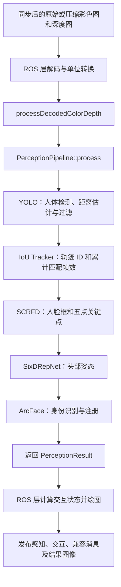
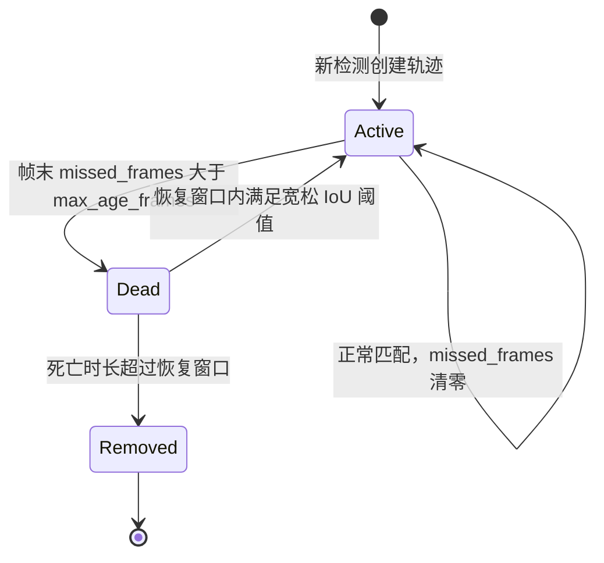
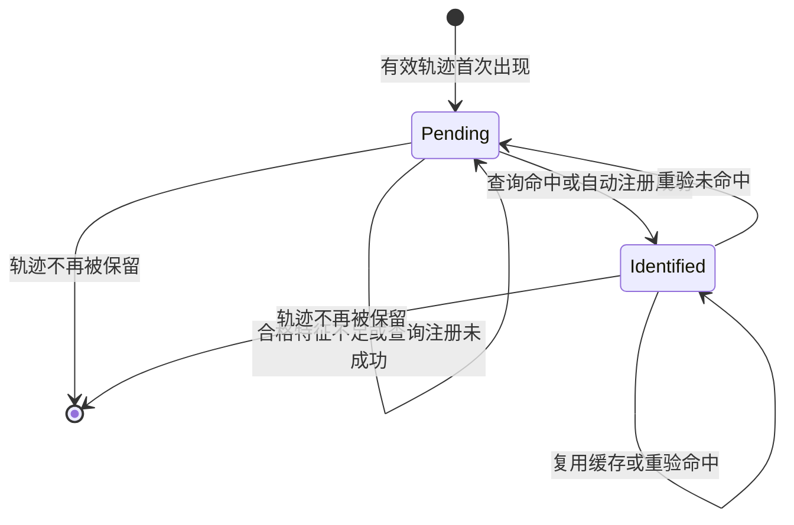

# 感知 Pipeline 流程与维护说明

> 核对日期：2026-09-09；第 6、7 节追踪及人脸检测模块于 2026-09-10 重新核对。本文描述当前源码行为，参数以 `config/pipeline.yaml` 为配置快照。历史变更见 [README_update.md](README_update.md)；历史记录或代码注释与实现不一致时，以实现为准，差异集中列在第 10 节。

## 1. 文档范围与阅读导航

这条流水线接收一组彩色图和深度图，依次回答：画面里有哪些人、每个人距离多远、是否与上一帧的人对应、脸在哪里、头朝哪个方向，以及是否能关联到人脸库中的人物。

本文重点解释算法编排和跨帧状态，同时说明 ROS 输入、发布和改名服务的衔接位置。TensorRT 模型训练、引擎导出和交互策略的完整实现不在本文范围内。

| 想了解的问题 | 阅读位置 |
| --- | --- |
| 整体调用顺序、输入输出 | 第 2～4 节 |
| 人体与距离如何产生 | 第 5 节 |
| ID 如何保持、丢失后如何恢复 | 第 6 节 |
| 人脸如何从人体区域中找到 | 第 7 节 |
| 头姿如何计算 | 第 8 节 |
| 何时识别、注册、重验和改名 | 第 9 节 |
| 当前限制与容易误读的行为 | 第 10 节 |
| 调参入口与后续迭代验证 | 第 11～12 节 |

## 2. 总体架构与执行顺序

### 2.1 从 ROS 图像到发布结果



上述阶段在一次 `process()` 调用内按顺序执行，没有在总调度器中并行启动。SCRFD、SixDRepNet 和 ArcFace 内部也逐人处理。底层使用 GPU 不代表各 Pipeline 在编排层并行运行。

ROS 边界位于 [perception_ros_component.cpp](src/perception_ros_component.cpp)：原始图像经 `processColorDepth()` 转换，压缩图像经对应回调解码，最终复用 `processDecodedColorDepth()`。该函数填写消息头和图像尺寸，调用算法，再通过 `updateInteractionResult()` 更新每个人的 `status`，绘制结果并按订阅情况发布。

`PerceptionPipeline` 只负责算法编排，不订阅、不发布，也不直接计算交互状态。直接调用算法接口时，调用方需要自行填写 `header`、`image_width`、`image_height`。

### 2.2 各模块职责与依赖

| 顺序 | 模块 | 主要输入 | 主要输出 | 是否维护跨帧状态 |
| --- | --- | --- | --- | --- |
| 1 | `YOLOPipeline` | 彩色图、米制深度图 | 按类别和距离过滤后的人体框、置信度、距离，创建 `persons` | 可选距离 EMA |
| 2 | `IouTracker` | 当前人体框、历史轨迹框 | `track_id`、累计匹配帧数、保留 ID 集合 | 是：轨迹与老化状态 |
| 3 | `SCRFDPipeline` | 彩色图、人体框 | 人脸框、置信度、五点关键点 | 否 |
| 4 | `SixDRepNetPipeline` | 彩色图、当前人脸框 | `yaw/pitch/roll` | 否 |
| 5 | `ArcFacePipeline` | 彩色图、轨迹、人脸关键点、可选头姿 | UUID、姓名、识别相似度 | 是：识别状态和特征缓冲；另有持久化数据库 |

SCRFD 依赖人体框，但不要求有效轨迹 ID；SixDRepNet 依赖人脸，不要求身份识别成功。ArcFace 则必须有有效轨迹 ID 和当前人脸。头姿位于 ArcFace 之前，是为了让识别门控可以使用当前帧姿态。

## 3. 数据约定与生命周期

### 3.1 输入图像与坐标

总入口接口见 [perception_pipeline.hpp](include/perception_pipeline.hpp)：

```cpp
void PerceptionPipeline::process(
    const cv::Mat &rgb,
    const cv::Mat &depth,
    PerceptionResult &perception_result);
```

虽然形参叫 `rgb`，实际输入是 OpenCV **BGR、8 位三通道**图像。深度图应为 **`CV_32FC1`、单位米**；ROS 层负责解码和转换。不要把毫米整数深度直接传入这个接口。

人体、人脸消息框使用彩色原图像素坐标：`x/y` 是左上角，`w/h` 是宽高。SCRFD 在局部 ROI（从原图裁出的区域）上检测后，需要把框和关键点加上 ROI 偏移，才能给后续模块使用。

YOLO 深度采样支持按宽高比例把彩色坐标映射到不同分辨率的深度图。这只是分辨率缩放，不是相机标定或视差配准；输入 RGB-D 应由上游保证空间对应关系。底层直接按连续内存复制图像，独立集成时还应保证输入矩阵连续且生命周期覆盖调用过程。

### 3.2 对外结果与内部上下文

| 数据 | 用途 | 生命周期 |
| --- | --- | --- |
| `PerceptionResult.persons[i]` | 对外发布第 `i` 个人的检测、轨迹、头姿和身份 | 每帧重新生成 |
| `PerceptionFrameContext.persons[i]` | 同一个人的轨迹累计帧数及底层 `FaceObject` | 仅当前 `process()` 内 |
| `retained_track_ids` | 告诉 ArcFace 哪些轨迹仍应保留识别状态 | 每帧从追踪器重新生成 |
| `IouTracker::tracks_by_id_` | 最近人体框、失配帧数、累计匹配帧数、死亡时间 | 随追踪器实例跨帧保存 |
| `ArcFacePipeline::recognition_states_` | 按 `track_id` 保存身份及待识别特征 | 随模块实例跨帧保存，按保留 ID 清理 |
| SQLite 人脸库 | 人物 UUID、姓名及特征等信息 | 文件持久化，可跨进程重启 |

上下文定义见 [perception_frame_context.hpp](include/pipeline/perception_frame_context.hpp)。`persons[i]` 的索引必须始终与消息一致。**索引只是本帧位置，不能作为跨帧身份**；后续若排序、删除人员，必须同步维护上下文。

`track_id` 是当前追踪器实例内从 0 递增的会话编号，重启后不能用它确认人物身份。`person_uuid` 是数据库人物标识；不同轨迹可以识别为同一个 UUID。

五点关键点和 512 维 Embedding 留在进程内部，不通过当前 `FaceRecog` 消息发布。消息定义见 [PersonMeta.msg](../trt_infer_msgs/msg/PersonMeta.msg)、[FaceRecog.msg](../trt_infer_msgs/msg/FaceRecog.msg)。

### 3.3 输出字段的有效性

| 字段或组合 | 当前含义 |
| --- | --- |
| `body_distance > 0` | 有效距离，单位米，写入时保留三位小数 |
| 距离为 -1、0、其他负值或超过 `max_distance_m` | 该目标在 YOLO 阶段被过滤，不进入人员列表；当前路径不再通过输出 -1 表示距离无效 |
| `track_id == -1` | 未关联轨迹，例如追踪关闭或人体框无效 |
| `face_detection.has_face == true` | 当前帧成功输出人脸 |
| 人脸框和置信度为零 | 正常总流程下未获得人脸，可能是未检出、关闭或超出 ROI 数量上限 |
| `person_uuid` 为空 | 当前没有已确认身份 |
| UUID 非空、姓名为空 | 已关联数据库人物，但尚未命名 |
| UUID 非空、相似度为 0 | 可能是刚自动注册，不能仅据此判断未识别 |
| `yaw/pitch/roll == 0` | 可能是正面姿态，也可能是模块关闭、跳过或失败；当前不能单靠零值区分 |

## 4. 初始化与单帧总调度

### 4.1 初始化

`PerceptionPipeline` 构造函数调用 `initialize()`，依次创建五个子模块。四个模型模块在构造时调用 `loadParameters()` 和 `initialize()`；追踪器仅加载参数。

模型模块关闭时不加载引擎。启用时检查模型文件是否存在，再创建对应 TensorRT 实例。ArcFace 还会创建数据库父目录并打开 SQLite 数据库。模型不存在、SCRFD 预处理模式不支持、数据库打开失败等情况会抛出异常，总调度器没有自动降级为“仅跳过失败模块”的逻辑。

模型路径解析规则一致：

1. `*_engine_path` 非空且为绝对路径：直接使用。
2. 非空且为相对路径：相对于 `TRT_WORKSPACE_ROOT` 解析。
3. 为空：使用 `TRT_WORKSPACE_ROOT/models/<模块目录>/*_engine_name`。

`face_db_path` 的相对路径同样基于 `TRT_WORKSPACE_ROOT`。这个根目录由 [CMakeLists.txt](CMakeLists.txt) 在编译配置时确定，默认是当前包上两级的 `vision_ws`，可通过 CMake 参数覆盖，并非运行时的当前目录。

配置在构造时加载；修改 YAML 不会自动热更新。通常需要重启并确认实际加载的配置文件和引擎路径。

### 4.2 每帧执行

对应 [PerceptionPipeline::process()](src/perception_pipeline.cpp)：

1. 清空 `persons`，将人体、人脸、头姿、识别四个耗时字段置零，避免沿用上一帧结果；不清理追踪器或识别模块的历史状态。
2. 调用 YOLO，完成检测、距离估计及类别和距离过滤，创建当前帧人员列表。
3. 创建新的 `PerceptionFrameContext`，执行 `frame_number = ++frame_number_`，首帧编号为 1。
4. 调用追踪器，为人员分配轨迹并初始化对应上下文。
5. 调用 SCRFD，补充当前人脸和关键点。
6. 调用 SixDRepNet，补充当前头姿。
7. 调用 ArcFace，更新或复用身份，然后返回结果。

没有人体时，后续调用仍会发生。追踪器仍老化、清理历史轨迹；ArcFace 在模块正常启用且图像非空时仍按保留 ID 清理状态。帧号和老化帧数按实际 Pipeline 调用推进，不是按相机标称帧率推进。

## 5. 步骤一：YOLO 人体检测与距离估计

接口与实现：[yolo_pipeline.hpp](include/pipeline/yolo_pipeline.hpp)、[yolo_pipeline.cpp](src/pipeline/yolo_pipeline.cpp)。入口为 `YOLOPipeline::process(rgb, depth, perception_result)`，核心调用是底层 [YOLOEngine::inferWithDepth()](../trt_infer/include/yolo_trt/yolo_engine.cpp)。

### 5.1 找到候选目标

底层先检查彩色图和深度图是否为空；任何一张为空，返回空检测列表。随后上传图像到 GPU、预处理并执行 TensorRT 推理。当前实现对方形输入使用等比例缩放加补边（letterbox），非方形输入走直接缩放分支。

推理结果经 GPU 后处理得到候选框，再进行深度采样，最后在 CPU 调用 `cv::dnn::NMSBoxes()` 抑制重叠候选框。NMS 可以理解为：同一位置出现多个相近框时，优先保留高置信度框。

`YOLOPipeline` 遍历返回的检测，若 `only_human_class=true`，只保留 `class_id == human_class_id` 的目标。关闭这个开关会让其他类别也进入 `persons`，后续仍按人体处理，因此不能把该开关简单理解为无影响地扩展类别。

### 5.2 从人体区域估计距离

采样实现见 [yolo_gpu_preprocess.cu](../trt_infer/include/yolo_trt/yolo_gpu_preprocess.cu) 的 `yolo_depth_sampling_kernel()`：

1. 将人体框按分辨率比例映射到深度图。
2. 在框内选择采样区域。当前配置取高度的 `0.52～0.98`，左右各去掉 `0.2` 的宽度，主要读取人体下半部中间区域。
3. 把采样区域裁到深度图边界，按网格采样，最多收集 64 个有效值。
4. 只接受有限且在 `[min_depth_m, max_depth_read_m]` 内的深度；少于 3 个有效样本时不能得到有效距离，保留底层初始化的 `-1`，随后由第 5.3 节的距离过滤移除该目标。
5. 对样本从近到远排序，按 `depth_trim_close_ratio` 去除一部分近端样本，再按 `depth_percentile` 选择剩余样本。`0.5` 表示取中间位置附近的样本，不是对全部像素求平均。

这得到的是深度 ROI 的代表值，并未利用相机内参计算人体中心到相机的三维欧氏距离。

### 5.3 距离过滤、平滑与消息写入

模块先检查深度采样得到的距离，当前代码的过滤条件为：

```cpp
if (distance > max_distance_m_ or distance <= 0.0f) {
  continue;
}
```

即对有限距离值，只保留 `0 < distance <= max_distance_m` 的目标。当前 `max_distance_m=5.0`：估计距离为 6 米、0 米或无效值 -1 的目标都不会创建 `PersonMeta`，不会输出人体框，也不会进入后续追踪匹配、人脸检测、头姿估计和身份识别；距离恰好为 5 米时仍保留。过滤发生在 EMA 平滑和距离取整之前，不会因历史平滑值偏小而保留当前超距目标。

底层以 `-1` 表示未得到有效距离，因此距离未知的目标也会被过滤。例如深度 ROI 无效、有效样本不足，或深度样本全部超过 `max_depth_read_m` 被排除，都会使该目标无法进入后续模块。这里判断的是采样结果，距离未知不代表真实距离超限，但当前策略将两者都排除。

距离过滤不会省去 YOLO 推理和深度采样本身，只减少后续模块对该目标的处理。已有轨迹若因超距或深度无效不再匹配，会按追踪器规则老化、保留或清理，而不是立即删除历史状态。即使彩色图中仍能看见人体，连续深度失效也可能导致其轨迹死亡。

开启 `distance_ema_enable` 时，对有效距离执行：

```text
平滑距离 = alpha × 当前距离 + (1 - alpha) × 历史平滑距离
```

当前 EMA 按底层检测数组索引保存，发生在追踪之前，并不按 `track_id` 绑定；检测数量变化会重置有效标记，数量相同但顺序变化则可能混用不同人的历史值。当前配置关闭 EMA。

最后为每个保留检测创建 `PersonMeta`，写入人体框、置信度和取整到三位小数的距离，记录 `body_detection_ms`。当前已移除 `depth_valid` 分支和写入 `-1` 的回退逻辑；通过过滤的目标直接使用当前距离或 EMA 平滑后的距离。`depth_scale_to_meters` 虽被加载，但未在该路径中使用；深度单位转换依赖 ROS 输入层。

## 6. 步骤二：IoU 追踪与轨迹生命周期

接口与实现：[iou_tracker.hpp](include/pipeline/iou_tracker.hpp)、[iou_tracker.cpp](src/pipeline/iou_tracker.cpp)。入口为 `IouTracker::process(perception_result, frame_context)`。

IoU 是两个矩形交集面积除以并集面积。两个框重叠越多，IoU 越大。追踪器用它推测“本帧这个人体是否就是之前那个人”，不使用人脸、外观特征、运动预测或深度。

### 6.1 匹配和分配 ID

`process()` 按以下五个阶段编排，消息和上下文始终保持同样的人员顺序：

1. **初始化本帧上下文。** 按人员数量重建 `frame_context.persons`。追踪关闭时把消息 `track_id` 设为 `-1`、清空保留 ID，然后返回；不清空追踪器内部历史状态。
2. **累计失配并准备人体框。** `incrementMissedFrames()` 将所有活跃轨迹的 `missed_frames` 加 1，随后收集本帧人体框。这里先假设轨迹失配，匹配成功再清零，所以无人帧也能推进轨迹老化。
3. **先正常匹配，再恢复或新建。** `matchActiveTracks()` 返回与人体框索引一致的轨迹指针列表；空指针表示尚未匹配。`recoverOrCreateTracks()` 只处理剩余的有效框，为它们恢复死亡轨迹或分配新 ID。
4. **更新生命周期和保留集合。** `retireAndRemoveExpiredTracks()` 在匹配结束后标记死亡、清理超期轨迹；`collectRetainedTrackIds()` 收集仍保留的全部 ID，供 ArcFace 清理识别状态使用。
5. **回写本帧结果。** 将轨迹 ID 写入消息和上下文，把内部 `matched_frames` 写入现有上下文字段 `track_total_frames`。仅输出本帧已有检测，不为历史轨迹补框。

`matchActiveTracks()` 的内部步骤：

- 收集活跃轨迹，对每个有效检测框计算与各条活跃轨迹的 IoU，将 `IoU >= match_iou_threshold_` 的组合记为 `MatchCandidate`。
- 按 IoU 从高到低排序，贪心选择一对一匹配；某检测或轨迹已被使用，就不能再次匹配。候选遍历顺序和相同 IoU 时的排序规则保持原实现，不添加新的优先级，也不使用匈牙利算法。
- 成功时调用 `Track::updateFromDetection()` 更新最近人体框、清零连续失配帧数、增加累计匹配帧数，并确保轨迹处于活跃状态。

`recoverOrCreateTracks()` 按检测顺序处理未匹配框：先调用 `findRecoveryCandidate()`，只查找恢复窗口内满足宽松阈值的最佳死亡轨迹，不在查找函数里修改状态。找到后立即调用 `updateFromDetection()` 重新激活，因此同一死亡轨迹不能在本帧被两个检测重复恢复。未找到则创建轨迹，分配 `next_track_id_++`，同样调用该更新接口，使累计匹配帧数从 1 开始。

宽高无效的检测框不参与匹配，也不创建轨迹，对应 `track_id=-1`。本帧新建的轨迹不会参与同帧剩余检测的正常匹配。轨迹存储使用 `std::map`，插入不会使已有轨迹指针失效；帧末清理也不会删除本帧已匹配的活跃轨迹。

### 6.2 活跃、死亡、恢复、清理



当前 YAML 的 `max_age_frames=10`。连续 10 次调用未匹配时轨迹仍活跃，第 11 次仍未匹配才在帧末标记死亡。由于匹配先于退休，本帧若成功匹配，连续失配帧数会清零，轨迹不会死亡。

死亡后的恢复由 `std::chrono::steady_clock` 计时，当前窗口为 30 秒。实现将时长截成整数秒后用 `>` 判断超期，不是精确到毫秒的立即删除。

恢复阈值为 `iou_threshold × revive_iou_scale`，当前为 `0.30 × 0.40 = 0.12`，且要求 IoU **严格大于**该值。恢复时沿用旧 ID，继续增加累计匹配帧数。死亡轨迹保存的是最后一次人体框，因此恢复只依据旧位置的重叠程度；参数名里的 `reid` 不代表外观重识别。

`matched_frames` 是累计成功匹配次数，包括新建时的一次，不要求连续，也不会在短期丢失后归零。ArcFace 的 `min_track_frames` 使用的就是这个值。

暂时未检测到的轨迹不会被补成 `persons` 输出；它们只在内部保留。`activeTrackCount()` 统计未死亡轨迹（`liveCount()` 保留为兼容入口），可能包含本帧未匹配轨迹，不能等同于本帧检测人数。`retained_track_ids` 则同时包含活跃和尚未清除的死亡轨迹，使 ArcFace 能在短期恢复后继续使用原识别状态。

### 6.3 内部命名与配置兼容

本次整理只调整内部命名、函数职责和注释，不改变 YAML 键名、配置值、消息字段及匹配行为。对外的 `process()`、`loadParameters()`、`isEnabled()` 保持不变，原计数接口 `liveCount()` 转发到更明确的 `activeTrackCount()`。

| 成员 | 含义 | 对应 YAML 键或输出 |
| --- | --- | --- |
| `Track::last_body_bbox` | 最近一次成功匹配框，恢复也用这个位置 | 来自 `body_detection.body_bbox` |
| `Track::missed_frames` | 连续失配帧数 | 与 `max_missed_frames_` 比较 |
| `Track::matched_frames` | 累计匹配帧数，包含新建帧 | 写入 `track_total_frames` |
| `Track::is_inactive` / `inactive_since` | 死亡状态及其起始时间 | 控制恢复与清理 |
| `match_iou_threshold_` | 正常匹配的最小 IoU | `iou_threshold` |
| `max_missed_frames_` | 允许连续失配帧数 | `max_age_frames` |
| `recovery_window_seconds_` | 死亡轨迹恢复窗口 | `reid_window_seconds` |
| `recovery_iou_scale_` | 恢复阈值相对于正常阈值的比例 | `revive_iou_scale` |
| `next_track_id_` / `tracks_by_id_` | 下一个 ID / 按 ID 保存的保留轨迹 | 仅内部使用 |

正常匹配使用 `>=`，恢复匹配使用 `>`，死亡和超期清理也使用 `>`；时间继续按整数秒比较。调整代码时应保留这些边界及“匹配先于退休”的顺序，避免仅做结构整理却改变原有 ID 行为。

## 7. 步骤三：SCRFD 人脸检测与坐标回写

接口与实现：[scrfd_pipeline.hpp](include/pipeline/scrfd_pipeline.hpp)、[scrfd_pipeline.cpp](src/pipeline/scrfd_pipeline.cpp)。入口为 `SCRFDPipeline::process(bgr, perception_result, frame_context)`。

### 7.1 从人体框构建头肩 ROI

`buildHeadShoulderRoi()` 先把人体框裁到图像内，裁后宽或高小于 4 则返回空区域。基于裁后人体框 `(x, y, w, h)`，当前配置大致产生：

```text
ROI 宽度 = ceil(w × (1 + 2 × 0.24))，至少 8 像素
向上扩展 = min(y, ceil(h × 0.14))
ROI 顶边 = y - 向上扩展
ROI 高度 = max(8, ceil(h × 0.58)) + 向上扩展
```

ROI 水平居中于人体框，最后再次裁到图像内。这样既关注人体上半部，也给头顶和两侧留出余量。裁后 ROI 宽或高小于 `face_roi_min_side`（当前 48）就跳过。

### 7.2 检测、选脸和还原坐标

1. 重置上下文的 `has_face`，并清零消息人脸框和置信度。正常总流程的人员消息由 YOLO 新建，因此消息 `has_face` 初始为 false。
2. 按 `persons` 现有顺序处理人体 ROI，最多 `max_person_rois` 个，当前为 8。计数在尺寸检查前增加，所以无效或过小 ROI 也占额度；没有额外按距离或轨迹稳定性排序。
3. `detectBestFaceInRoi()` 调用 `SCRFD_TRT::detect(bgr(head_roi), faces, face_confidence_threshold_, face_nms_iou_threshold_)`。没有候选时返回 false，保留该人体但不输出人脸。
4. `detectBestFaceInRoi()` 使用 `std::max_element()` 只选置信度最高的一张，置信度相等时保留返回列表中先出现的人脸。输出的 `roi_face` 仍是 ROI 局部坐标，不在该函数内平移。没有进一步按人体中心或跨帧人脸位置关联。
5. `writeFaceResult()` 将人脸框和全部五点关键点加上 ROI 的左上角偏移，变为全图坐标。
6. `writeFaceResult()` 对人脸框的 x/y 向下取整、宽高向上取整，再裁到图像内；裁后宽高无效就返回，不尝试次高置信度人脸。有效时写入 `has_face=true`、框和置信度；上下文保存包含浮点框、关键点、置信度的 `FaceObject`，并标记 `has_face=true`。

消息中的人脸框是裁后整数框，上下文中的 `face.rect` 是平移后的浮点框，两者不保证逐像素相同。SixDRepNet 使用后者再扩框；ArcFace 的尺寸门控使用消息框，对齐使用上下文关键点。

由于每个人体 ROI 独立检测且没有跨 ROI 人脸去重，人体框重叠时可能选到同一张脸。YOLO 没有输出人体时，本模块不会补做全图找脸。

### 7.3 `process()` 编排与命名约定

`process()` 保留四个直接可见的阶段：重置本帧人脸数据 → 构建并检查头肩 ROI → 检测选脸 → 坐标转换与回写。成员函数只拆出独立职责，不改变执行顺序和检测策略。

| 函数 | 职责 | 坐标约定 |
| --- | --- | --- |
| `buildHeadShoulderRoi()` | 读取成员中的 ROI 比例，按裁后人体框扩展并裁到图像边界 | 输入人体框和输出 ROI 都是全图坐标 |
| `detectBestFaceInRoi()` | 在指定 ROI 上推理并选择最高置信度人脸 | 输出 `roi_face` 是 ROI 局部坐标 |
| `writeFaceResult()` | 平移框及关键点，检查裁后框，写消息与上下文 | 输出是全图坐标，消息框为整数、上下文框为浮点 |

形参 `bgr` 明确表示 BGR 彩色图，只有形参名称变化，公共接口类型及调用方式不变。`attempted_person_rois` 表示已经尝试的人员 ROI 数量，不是实际模型推理次数；它在 ROI 尺寸检查之前增加。只有有效 ROI 才调用检测器。

| 内部成员 | 含义 | 保持兼容的 YAML 键 |
| --- | --- | --- |
| `face_detector_` | SCRFD TensorRT 检测器实例 | 无 |
| `engine_filename_` / `engine_path_` | 默认引擎文件名 / 最终解析路径 | `scrfd_engine_name` / `scrfd_engine_path` |
| `preprocess_mode_` | 转为小写的预处理模式 | `preprocess` |
| `face_confidence_threshold_` | 人脸候选置信度阈值 | `prob_threshold` |
| `face_nms_iou_threshold_` | 人脸候选 NMS IoU 阈值 | `nms_threshold` |
| `head_roi_height_ratio_` | 基础 ROI 高度相对裁后人体高度的比例 | `person_head_height_ratio` |
| `head_roi_side_padding_ratio_` | 左右各扩展的裁后人体宽度比例 | `person_head_width_pad_ratio` |
| `head_roi_top_expansion_ratio_` | 向上扩展的裁后人体高度比例 | `person_head_top_expand_ratio` |
| `min_head_roi_side_px_` | 头肩检测区域最小边长，不是输出人脸最小尺寸 | `face_roi_min_side` |
| `max_person_roi_attempts_` | 每帧尝试处理的人数上限，包括无效和过小 ROI | `max_person_rois` |

本节配置已对照工作空间的 [pipeline.yaml](../../config/pipeline.yaml) 核验，SCRFD 的当前值与第 11.4 节一致。此次保留所有 YAML 键名、数值、加载范围限制，以及 `loadParameters()`、`initialize()`、`isEnabled()`、`getEnginePath()` 公共接口。

重置时仅调整上下文人员数量、清理上下文 `has_face` 和消息框及置信度，不重新创建整个人员上下文，因此不会丢失追踪器写入的 ID 和累计匹配帧数。沿用现有行为：消息 `has_face` 未显式清零，上下文旧 `face` 数据也不会清空，消费端应按上下文 `has_face` 判断是否有效；正常总流程依赖 YOLO 每帧新建消息。单独复用旧消息的限制仍见第 10.2 节，本次没有混入行为修复。

计时仍从重置及启用检查之后开始，覆盖全部 ROI 循环。关闭模块、无检测器或输入图像为空时直接返回，不在 SCRFD 内重写耗时字段；总调度器负责每帧将其置零。检测异常仍向调用方传播，没有新增捕获或重试。

## 8. 步骤四：SixDRepNet 头部姿态估计

接口与实现：[sixdrepnet_pipeline.hpp](include/pipeline/sixdrepnet_pipeline.hpp)、[sixdrepnet_pipeline.cpp](src/pipeline/sixdrepnet_pipeline.cpp)。入口为 `SixDRepNetPipeline::process(rgb, frame_context, perception_result)`。

1. `clearHeadPose()` 先把所有人的 `yaw/pitch/roll` 设为 0。
2. 模块关闭、引擎不存在或彩色图为空时直接返回；否则按消息和上下文数量的较小值遍历。
3. 跳过上下文 `has_face=false` 的人。
4. `expandFaceRect()` 以人脸中心为基准，宽高分别乘以 `1 + 2 × face_expand_ratio`，取整并裁到图像内。当前扩展率为 `0.12`，即宽高约变成原来的 `1.24` 倍。
5. 检查**扩展且裁剪后的 ROI**，宽高均达到 `min_face_px`（当前 36）才调用 `SixDRepNet_TRT::predict(rgb(face_roi))`。
6. 三个角度均为有限值时写回消息；非有限值或捕获到推理异常时保留零值。单个人推理抛出的 `std::exception` 被记录后，循环继续处理其他人。

`yaw` 表示左右转头，`pitch` 表示抬头低头，`roll` 表示侧倾，单位都是度。Pipeline 直接转写模型角度，不做符号变换或跨帧平滑。当前消息注释与历史更新记录对 yaw/pitch 正负方向的描述存在冲突，因此新增消费端时应结合实际模型输出和可视化核验，不能把某一处注释当作已统一的接口约定。

当前没有有效性字段区分“成功预测为正面”和“未预测”。这会影响 ArcFace 的可选姿态门控及下游交互判断，详见第 10 节。

## 9. 步骤五：ArcFace 身份识别、注册与重验

接口与实现：[arcface_pipeline.hpp](include/pipeline/arcface_pipeline.hpp)、[arcface_pipeline.cpp](src/pipeline/arcface_pipeline.cpp)。入口为 `ArcFacePipeline::process(rgb, frame_context, perception_result)`。

### 9.1 状态准备与质量门控

每帧先通过 `clearMessage()` 清空消息中的 UUID、姓名和相似度。模块正常可用时，`pruneStates(retained_track_ids)` 删除已不被追踪器保留的内存识别状态，但不会删除 SQLite 人物记录。

对有效 `track_id`，取出或新建 `RecognitionState`，初始状态为 `Pending`（待识别）。`passesQualityGate()` 要求同时满足：

| 条件 | 当前 YAML 值或规则 | 通俗解释 |
| --- | --- | --- |
| 有当前人脸 | `person_context.has_face=true` | 本帧确实检测到了脸 |
| 有轨迹 | `track_id >= 0` | 能把跨帧特征归到同一条轨迹 |
| 累计匹配次数足够 | `track_total_frames >= 7` | 避免轨迹刚出现就立刻识别 |
| 人脸置信度足够 | `face_confidence >= 0.75` | 降低不可靠人脸检测的影响 |
| 人脸大小足够 | 消息框宽、高均 `>= 48` | 保证基本图像细节 |
| 可选姿态限制 | `require_head_pose=true` 时检查 | yaw/pitch 有限，且绝对值分别不超过 30/25 度 |

当前 `require_head_pose=false`，不使用角度限制。即使启用，也只检查 yaw/pitch，不检查 roll，也不能确认 SixDRepNet 本帧是否真正成功。

### 9.2 决定是否提取特征

质量门控通过后，还需要满足以下任一条件：当前状态为 `Pending`；或者已识别状态距离上次查询至少经过 `recheck_interval_frames`（当前 50）次 Pipeline 帧号推进。

`extractEmbedding()` 调用 `ArcFaceTRT::alignFace(rgb, landmarks)`，把双眼、鼻尖和嘴角五点对齐到标准 112×112 人脸，再提取 512 维特征。底层接口见 [arcface_trt.cpp](../trt_infer/include/arcface_trt/arcface_trt.cpp)。对齐或特征提取失败时，不推进识别状态。

没有达到重验间隔，或当前脸质量不够时，已识别轨迹仍通过 `writeIdentity()` 输出缓存身份。因此当前帧没有人脸也可能有 UUID；这表示沿用轨迹身份，不代表本帧进行了人脸确认。

### 9.3 待识别：积累、查询、自动注册

`processPending()` 的处理顺序：

1. 保存本次 Embedding，同时保存对应 yaw、pitch 和人脸置信度。
2. 特征数量不足 `embedding_buffer_size`（当前 5）就等待后续合格帧。中间不合格帧不会清空缓冲，因此不要求连续 5 帧。
3. 数量达到要求时，调用 `FaceDatabase::identify(embedding, recog_threshold)`。**查询只使用本次、即最后一帧特征，不对缓冲做平均或投票。**
4. 匹配成功：进入 `Identified`，保存 UUID、姓名、相似度，并调用 `touchPerson()` 更新数据库最近出现信息。
5. 匹配失败且 `auto_register=true`：调用 `registerPerson()`，用整组缓冲特征及元数据注册新人物。成功后进入 `Identified`，获得新 UUID，姓名为空，相似度为 0。
6. 自动注册关闭或注册失败：保持 `Pending`。
7. 本轮查询结束后清空全部缓冲；若仍待识别，需要重新积累。

数据库 [FaceDatabase::identify()](../trt_infer/include/arcface_trt/face_database.cpp) 对查询特征与库内人物各条特征比较余弦相似度，选全库最高值；最高值达到阈值才算识别成功。当前每人最多保存 5 条特征，缓冲大小也被限制在 1～5。

### 9.4 已识别：周期重验

`processIdentified()` 使用新特征再次查询整个数据库，随后更新 `last_recog_frame`：

- 匹配成功：采用本次返回的 UUID、姓名和相似度，继续保持 `Identified`。这里允许匹配到与之前不同的 UUID，并非只验证原 UUID。
- 匹配失败：退回 `Pending`，清空身份和缓冲；本次重验特征不会自动成为新缓冲的第一条，后续合格帧重新积累。
- 到期但质量不合格或提取失败：本帧不重验，不更新查询帧号，仍输出原身份，之后遇到合格帧再尝试。



识别命中并不会把新特征自动追加到数据库，当前链路只更新人物最近出现信息。特征缓冲主要用于首次等待和未命中后的自动注册。

### 9.5 一条轨迹的时间示例

假设此人从 Pipeline 第 1 帧开始每帧匹配成功，并且每次人脸都通过门控，使用当前配置：

| Pipeline 帧号 | 处理结果 |
| --- | --- |
| 1～6 | 累计轨迹帧数不足 7，不提取识别特征 |
| 7～10 | 每帧积累一条，共 4 条 |
| 11 | 第 5 条到齐，用第 11 帧特征查询；未命中则尝试用 5 条特征注册 |
| 12～60 | 若已经识别成功，沿用缓存身份 |
| 61 | 距上次查询 50 帧，若质量合格则重验 |

如果第 61 帧背对相机，则延后重验；如果期间人体丢失，当前结果中没有这个人，但恢复窗口内仍可保留其识别状态。该示例是帧号推演，不是实际设备耗时或固定秒数承诺。

### 9.6 姓名更新接口

调用链为 `PerceptionRosComponent::updatePersonName()` → `PerceptionPipeline::updatePersonName(uuid, name)` → `ArcFacePipeline::updatePersonName(uuid, name)`。

ArcFace 先调用 `FaceDatabase::updateName()`，成功后遍历内存状态，把所有相同 UUID 的姓名同步更新。轨迹编号不变，后续消息使用新姓名。

现有 ROS 服务名为 `/human_face_fusion/update_person_name`，服务类型为 `trt_infer_msgs/srv/UpdatePersonName`，请求字段是 `person_uuid` 和 `name`。Pipeline 未初始化、ArcFace 关闭、UUID 为空或数据库更新失败时返回失败。服务响应细节由 ROS 层负责，算法接口仅返回 `bool`。

## 10. 模块关闭、异常与当前实现边界

### 10.1 关闭模块后的实际结果

| 配置变化 | 对整条流水线的影响 |
| --- | --- |
| 关闭 YOLO | 没有模块创建 `persons`；其他模块不补充人体 |
| 关闭 IoU Tracker | SCRFD 和头姿仍可运行，但 ID 为 -1，ArcFace 跳过人员识别 |
| 关闭 SCRFD | 没有当前人脸，头姿保持零值，ArcFace 不提取新特征；已存在的有效轨迹身份仍可被复用 |
| 关闭 SixDRepNet | 头姿保持零值；ArcFace 默认仍可识别 |
| 关闭 ArcFace | 人体、追踪、人脸和头姿保留，身份消息为空 |

这张表描述代码分支，不表示支持运行时热切换。初始化失败也不等同于配置关闭。

### 10.2 已确认的差异与限制

| 项目 | 当前事实 | 后续调整时的注意点 |
| --- | --- | --- |
| 无效头姿 | `clearHeadPose()` 写 0；源码的 `kInvalidHeadPoseDeg=999` 未被使用，旧记录中的 999 行为已不适用 | 不能用零角度证明预测成功；`require_head_pose=true` 也会接受这些零值，其他门控满足时仍可提特征 |
| 角度正负约定 | `HeadPose.msg` 注释与更新记录对 yaw/pitch 方向描述相反；Pipeline 不改符号 | 改动前通过实际动作统一模型、消息、绘图及消费端约定 |
| Embedding 发布 | 消息字段和写入代码已注释；早期记录和部分接口注释仍描述发布特征 | 当前 ROS 消费端只能读取 UUID、姓名、相似度 |
| SCRFD 重置 | 清理内部 `has_face`、消息框和置信度，但未显式把消息 `has_face` 置 false | 正常总流程依赖 YOLO 每帧新建消息；若单独复用旧消息调用 SCRFD，可能残留 true |
| 距离 EMA | 按检测索引关联历史，未绑定轨迹 | 多人顺序变化时可能混用历史距离 |
| 距离非有限值 | 当前过滤只有大小比较，没有显式 `std::isfinite` 检查；底层正常输出有限采样值或 -1 | 若其他输入路径传入 NaN，两次比较都为 false，目标会通过过滤；不能把当前条件描述为完整的非有限值校验 |
| 识别时效 | 质量不足时可以持续复用缓存身份，没有独立身份过期时限 | UUID 不代表本帧已确认；IoU 误关联也可能暂时沿用错误身份 |
| YOLO 坐标配置 | `bbox_coord_space` 被加载并传给引擎，但当前 `inferWithDepth()` 的 GPU 后处理未按 `bbox_in_original_space_` 分支 | 不应假定切换此参数就能修正当前 RGB-D 路径的框坐标；更换模型或输入形状需实测 |
| 运行时异常 | SixDRepNet 对逐人预测有局部异常捕获；总调度器没有逐阶段统一捕获 | 不能假设任意模块抛异常后其余模块仍会执行 |

这些内容是现状说明，不表示本次已修改算法。

### 10.3 耗时字段如何理解

`body_detection_ms`、`face_detection_ms`、`head_pose_ms`、`face_recog_ms` 是各模块在代码计时范围内的墙钟耗时，包含对应范围内的裁剪、循环、推理、后处理或数据库操作，不是纯 GPU kernel 时间。

追踪器没有独立耗时字段；ArcFace 计时从状态清理之后开始。模块提前返回时通常保持总入口设置的零值；模块启用但没有有效人脸时，也可能记录很小的循环耗时。因此零值不能独立证明“没有检测到目标”，四项相加也不等于 ROS 端到端延迟，后者还包含同步、解码、交互计算、绘图和发布等工作。

## 11. 配置参考与调参入口

配置入口为 [pipeline.yaml](config/pipeline.yaml)，各模块 `loadParameters()` 决定缺省值和取值限制。下表“当前值”是仓库 YAML 的值，不代表部署时一定加载它；代码默认值表示对应键缺省时的回退值。

### 11.1 模型与开关

| 模块配置节点 | 当前 `enable` / 代码默认 | 当前引擎名 / 代码默认引擎名 |
| --- | --- | --- |
| `yolo_pipeline` | true / false | `yolo26m_fp16.engine` / 相同 |
| `iou_tracker` | true / true | 无模型 |
| `scrfd_pipeline` | true / false | `scrfd_2.5g_bnkps_shape640x640.engine` / `scrfd_2.5g_bnkps_shape640x640.trt` |
| `sixdrepnet_pipeline` | true / false | `SixDRepNet_fp16.engine` / `SixDRepNet.engine` |
| `arcface_pipeline` | true / false | `arcface_w600k_r50_fp16.engine` / `w600k_r50_b16_gpu0_fp16.engine` |

四个 `*_engine_path` 当前均为空，按第 4 节规则拼接。`arcface_pipeline.face_db_path` 当前和默认均为 `db/face_db.sqlite3`。

### 11.2 YOLO 与距离

以下键属于 `yolo_pipeline`，当前值与代码默认值相同。

| 参数 | 当前值 | 调整含义 |
| --- | --- | --- |
| `conf_threshold` | 0.45 | 检测置信度阈值；提高通常减少低置信度目标 |
| `only_human_class` / `human_class_id` | true / 0 | 是否只保留指定人体类别 |
| `max_distance_m` | 5.0 | 人员输出距离上限；有限距离仅在 `(0, max_distance_m]` 内保留，非正距离或超距时过滤整个目标 |
| `min_depth_m` / `max_depth_read_m` | 0.08 / 25.0 | 采样深度有效区间，单位米 |
| `depth_roi_y0` / `depth_roi_y1` | 0.52 / 0.98 | 人体框内深度采样的垂直范围 |
| `depth_roi_x_margin` | 0.2 | 左右各排除的宽度比例 |
| `depth_trim_close_ratio` / `depth_percentile` | 0.0 / 0.5 | 近端样本裁剪和剩余样本分位位置 |
| `distance_ema_enable` / `distance_ema_alpha` | false / 0.35 | 距离平滑开关和当前帧权重 |
| `depth_scale_to_meters` | 0.001 | 当前调用路径未使用，不能靠它转换传入单位 |
| `bbox_coord_space` | letterbox | 已加载，但当前 RGB-D GPU 路径存在第 10 节所述限制 |
| `engine_input_h` / `engine_input_w` | 0 / 0 | 输入尺寸覆盖配置，0 使用引擎尺寸；修改须匹配引擎能力 |

YOLO 层未对上述数值统一执行范围限制。调整 ROI 和统计参数时，应保持 `0 <= y0 < y1 <= 1`、`0 <= x_margin < 0.5`、`0 <= trim_close_ratio < 1`、`0 <= percentile <= 1`，EMA 权重保持在 `[0,1]`，避免无效 ROI 或样本索引。

### 11.3 IoU Tracker

| 参数 | 当前值 / 代码默认 | 加载限制与含义 |
| --- | --- | --- |
| `iou_threshold` | 0.30 / 0.30 | 限制在 `[0.01,1]`；越高越要求框位置重叠 |
| `max_age_frames` | 10 / 30 | 至少 1；连续失配超过此值才死亡 |
| `reid_window_seconds` | 30 / 30 | 至少 0；死亡后保留和恢复窗口 |
| `revive_iou_scale` | 0.40 / 0.40 | 限制在 `[0.05,1]`；乘以正常阈值得到恢复阈值 |

### 11.4 SCRFD 与 SixDRepNet

下列参数当前值与代码默认相同。

| 配置节点 | 参数 | 当前值 | 加载限制或作用 |
| --- | --- | --- | --- |
| `scrfd_pipeline` | `preprocess` | insightface | 忽略大小写；支持 insightface、namdvt、upstream，后两者采用同一预处理模式 |
| `scrfd_pipeline` | `prob_threshold` | 0.38 | 限制在 `[0.08,0.95]`，人脸候选阈值 |
| `scrfd_pipeline` | `nms_threshold` | 0.45 | 限制在 `[0.15,0.95]`，人脸 NMS IoU 阈值 |
| `scrfd_pipeline` | `person_head_height_ratio` | 0.58 | 限制在 `[0.18,0.78]`，人体上部高度比例 |
| `scrfd_pipeline` | `person_head_width_pad_ratio` | 0.24 | 限制在 `[0,0.55]`，左右各扩展比例 |
| `scrfd_pipeline` | `person_head_top_expand_ratio` | 0.14 | 限制在 `[0,0.5]`，向上扩展比例 |
| `scrfd_pipeline` | `face_roi_min_side` | 48 | 至少 32，检测输入 ROI 最小边长 |
| `scrfd_pipeline` | `max_person_rois` | 8 | 至少 1，按顺序限制尝试处理数量 |
| `sixdrepnet_pipeline` | `min_face_px` | 36 | 至少 1，扩展裁剪后头姿 ROI 最小边长 |
| `sixdrepnet_pipeline` | `face_expand_ratio` | 0.12 | 限制在 `[0,0.5]`，四周扩展比例 |

### 11.5 ArcFace

以下键属于 `arcface_pipeline`。

| 参数 | 当前值 / 代码默认 | 加载限制与含义 |
| --- | --- | --- |
| `recog_threshold` | 0.45 / 0.45 | `[0.05,0.99]`；提高相似度门槛可能减少误认、增加未命中 |
| `auto_register` | true / true | 未命中时是否写库注册新人 |
| `min_face_px` | 48 / 64 | 至少 16；消息人脸框宽高门槛 |
| `min_face_confidence` | 0.75 / 0.75 | `[0,1]`；识别要求可高于 SCRFD 检测阈值 |
| `min_track_frames` | 7 / 20 | 至少 1；累计成功匹配次数门槛 |
| `embedding_buffer_size` | 5 / 5 | `[1,5]`；首次查询前的特征积累量 |
| `recheck_interval_frames` | 50 / 150 | 至少 1；已识别状态重验间隔 |
| `require_head_pose` | false / false | 是否检查 yaw/pitch，当前不能验证头姿推理成功 |
| `max_yaw_deg` / `max_pitch_deg` | 30.0、25.0 / 相同 | 各限制在 `[1,90]`，只在姿态门控开启时参与判断 |

## 12. 后续迭代与验证建议

### 12.1 按职责定位修改点

| 需求 | 优先检查的文件和函数 |
| --- | --- |
| 调整阶段顺序或加入新模块 | [perception_pipeline.cpp](src/perception_pipeline.cpp) 的 `initialize/process`，以及对应头文件 |
| 修改人体类别、有效距离或 EMA | [yolo_pipeline.cpp](src/pipeline/yolo_pipeline.cpp) 的 `process` |
| 修改深度采样或模型后处理 | 底层 `YOLOEngine::inferWithDepth`、`yolo_depth_sampling_kernel` |
| 修改匹配、老化和恢复 | `IouTracker::process/matchActiveTracks/recoverOrCreateTracks/retireAndRemoveExpiredTracks` |
| 修改找脸范围、选脸策略或人数上限 | `SCRFDPipeline::buildHeadShoulderRoi/detectBestFaceInRoi/writeFaceResult` |
| 修改头姿裁剪和失败语义 | `expandFaceRect`、`clearHeadPose`、`SixDRepNetPipeline::process` |
| 修改识别时机、注册或重验 | `passesQualityGate/processPending/processIdentified` |
| 新增内部中间数据 | [perception_frame_context.hpp](include/pipeline/perception_frame_context.hpp) |
| 修改发布字段、交互状态或服务 | [perception_ros_component.cpp](src/perception_ros_component.cpp) 和对应 `trt_infer_msgs` 消息/服务 |

新增数据时，先确定它只用于单帧传递、需要跨帧保存，还是需要对外发布，再选择上下文、模块成员或 ROS 消息。保留“追踪负责关联、ArcFace 负责身份”的现有分工。若修改无效头姿表示，应同步检查质量门控、交互计算和绘图消费方。

### 12.2 建议的最小回归场景

下面是未来修改算法时的验证清单，不是本次已执行的设备测试。

| 场景 | 应重点观察 |
| --- | --- |
| 空画面与连续无人帧 | `persons` 为空；历史轨迹按规则老化清理；没有上一帧人员残留 |
| 单人稳定出现 | ID 稳定；门控及缓冲达到要求后才查询/注册 |
| 深度无效或未知，距离为 -1、0 或其他负值 | 不输出该人体，后续模块不处理该目标；已有轨迹按失配规则老化 |
| 有限估计距离在 `(0,5)`、等于 5 或超过 5 米 | 正距离小于或等于上限时保留；超过上限时不输出人体，后续模块不处理该目标；开启 EMA 时仍按平滑前距离过滤 |
| 遮挡、恢复及超过恢复窗口 | ID 是否延续；累计匹配数是否保留；ArcFace 状态是否随轨迹清理 |
| 多人交叉或顺序变化 | 贪心匹配是否换 ID；若打开 EMA，距离是否混用 |
| 画面边缘、小人脸、超过 8 人 | ROI 裁剪及数量额度是否符合预期；无脸人员仍有身体结果 |
| 已识别人转头或暂时无脸 | 是否复用缓存；恢复合格人脸后是否按到期间隔重验 |
| 未命中且关闭自动注册 | 保持 Pending；重新积累特征；不新增人物 |
| 改名与进程重启 | 改名同步数据库和同 UUID 的内存状态；重启后会话 ID 与数据库 UUID 分别验证 |
| 模块关闭、缺失引擎、头姿预测失败 | 对照第 10 节检查输出和异常边界，不把零角度当作成功证据 |

涉及自动注册的回归使用独立测试数据库，便于判断新增记录并保留正式库。涉及模型与 GPU 的行为需在具备对应引擎和运行环境的设备上验证。

### 12.3 文档维护规则

修改流程时同步更新第 2 节调用图与相关步骤；修改参数时同步更新第 11 节的 YAML 当前值、代码默认值和范围限制；修改消息语义时同步更新第 3、10 节及消息定义。

新增历史记录写入 `README_update.md`，本文持续维护“当前实现”。特别是本次列出的行为差异，后续修复后应改写为修复后的实际规则，避免文档长期同时保留相互矛盾的现状描述。
